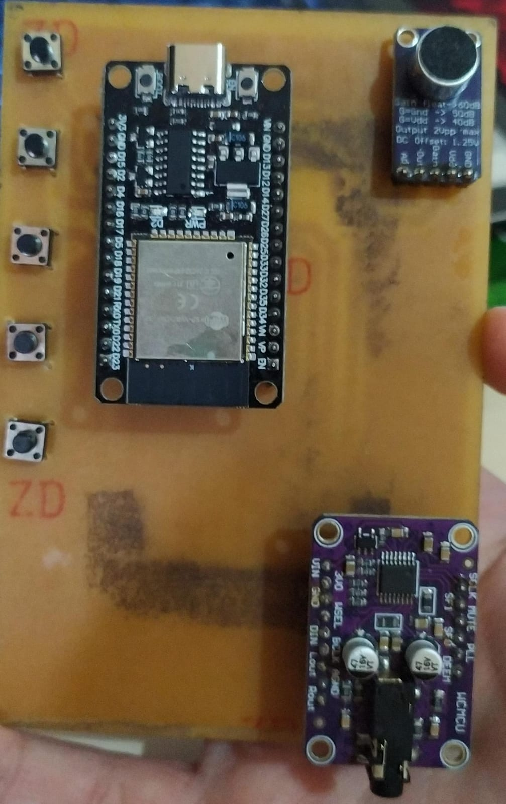
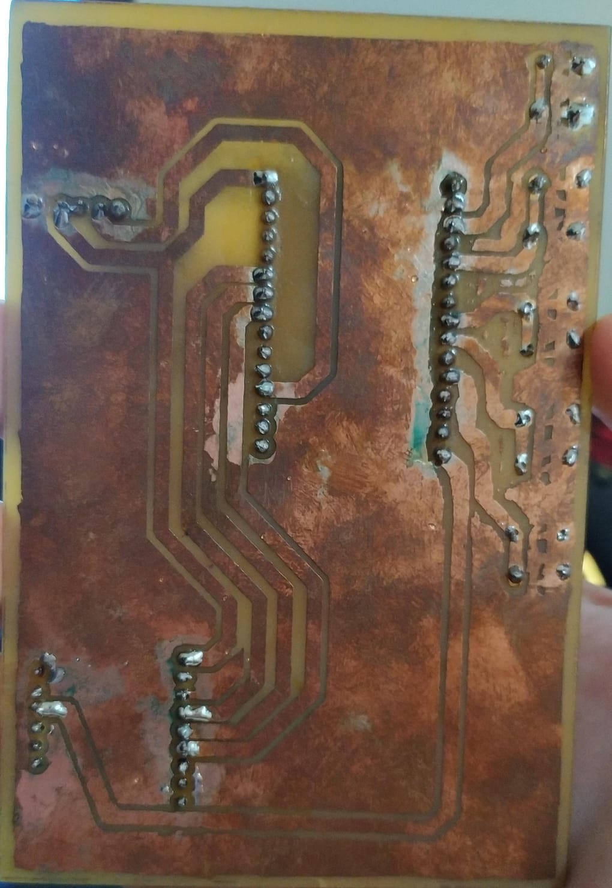

# Voice_Modulator
Projeto desenvolvido na matéria de Sistemas Embarcados no qual implementei um modulador de voz portátil utilizando a IDE Arduino e a biblioteca [Arduino Audio Tools](https://github.com/pschatzmann/arduino-audio-tools).  
O projeto envolve a leitura de um microfone analógico, modulação da voz de entrada e saída de áudio por meio do protocolo I2S para um decodificador UDA1334A, no qual é conectado um alto falando por meio da entrada P2 do módulo.  
Caso tenha interesse em vez o projeto funcionando, deixo uma [pasta pública](https://drive.google.com/drive/folders/1XFey5y5fppw4kVPfwgO6QmhTfpFx_6br?hl=pt-BR) com os arquivos referentes ao projeto e um vídeo demonstrativo.  
Por fim, para embarcar o projeto, manufaturei uma PCB contendo os componentes utilzados:  

 

